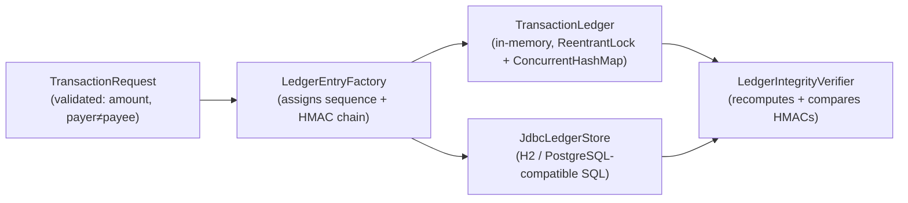

# Ledger Guard

A Java engine for **exactly-once, tamper-evident financial-style transactions** —
idempotent under retries, safe under real concurrency, and verifiable after the
fact via HMAC — with both an in-memory engine and a real, migrated SQL-backed store.

[](https://github.com/atreyamitra/SkillSwap/actions/workflows/android-ci.yml)

> **Scope note:** Ledger Guard is the `ledger/` module inside this repository,
> **SkillSwap** — an Android skill-exchange app that is otherwise unrelated (see
> `BUILD_NOTES.md`). The module has zero Android/Firebase dependency; it's a
> standalone Java library that happens to live in this repo. Built to explore
> financial-transaction engineering problems in the abstract — **not affiliated
> with, built for, or modeled on any bank**, and it makes no production,
> compliance, or scale claims (see "Security model / limitations").

## Why this exists

Most CRUD demos never touch the problems that actually separate engineering from
scripting: what happens when a request is retried, when two requests race, or
when stored data is silently altered. Ledger Guard was built to answer those
questions with code and tests, not slides — one JVM lock and one database
constraint at a time.

## Engineering highlights

- **Java 17, zero framework dependency** — `ledger/` compiles and runs with
  plain `javac` + JUnit; no Android, no Spring, no mocks standing in for real behavior.
- **Monetary correctness** — every amount is `BigDecimal`, normalized to a fixed
  scale at construction so `5` and `5.00` are never silently unequal; no
  `float`/`double` anywhere in the module.
- **Append-only ledger model** — each `LedgerEntry` chains to the one before it
  via a stored hash; the log, not a cache, is the source of truth for balances.
- **HMAC-SHA256 integrity** — every entry is signed; verification uses
  constant-time comparison (`MessageDigest.isEqual`), not `String.equals`.
- **Idempotency, enforced twice, independently** — a `ConcurrentHashMap`
  at-most-once guarantee in Java, *and* a `UNIQUE` constraint in SQL — so the
  guarantee survives even across two separate writer processes.
- **Concurrency safety proven, not assumed** — two deterministic stress tests
  (16 threads × 50 transactions in-memory; 30 concurrent JDBC connections
  against a real database) assert only invariants that hold under *any*
  interleaving. Each run 30 consecutive times in development with zero failures.
- **Real SQL persistence** — a normalized, migrated schema (PK/FK/UNIQUE/
  NOT NULL/CHECK constraints, indexes matched to actual queries), tested against
  a real H2 database, not a mock.
- **85 tests for this module** (140 across the repo), including 5 tests that
  bypass the Java API entirely to prove the *database* rejects bad data on its own.
- **CI on every push/PR** — GitHub Actions runs the full suite plus Android Lint
  and fails the build on any test failure.

## Architecture



Both engines consume the same `TransactionRequest`/`LedgerEntry` types and the
same `LedgerIntegrityVerifier` — the hash-chain logic exists exactly once,
shared by both. Full rationale: [`docs/INTEGRITY_AND_IDEMPOTENCY.md`](docs/INTEGRITY_AND_IDEMPOTENCY.md).

## Core invariants

1. **Idempotency** — the same key + same payload, any number of times or any
   concurrency, produces exactly one effect.
2. **Conflict rejection** — the same key + a *different* payload always throws,
   never silently overwrites.
3. **Sequence contiguity** — committed entries occupy exactly `{0..N-1}`, no gaps or duplicates.
4. **Chain integrity** — every entry's stored hash matches its recomputed HMAC;
   every `previousHash` matches its predecessor's.
5. **Atomicity** — a transaction fully commits (entry + both balances) or has no effect at all.
6. **Log-as-truth** — balances replayed from the log always equal the live cache.

## Example workflow

```java
TransactionLedger ledger = new TransactionLedger(hmacKey);
ledger.deposit("seed-1", "alice", new BigDecimal("100.00"));

TransactionRequest payment =
    new TransactionRequest("order-42", "alice", "bob", new BigDecimal("10.00"), "lunch");

ledger.submit(payment);          // commits: alice -10.00, bob +10.00
ledger.submit(payment);          // retried request -> replayed, NOT re-applied
ledger.verifyIntegrity();        // walks the hash chain, detects any tampering
```

## Getting started

```bash
git clone https://github.com/atreyamitra/SkillSwap.git
cd SkillSwap
```

`ledger/` has no Android dependency, so it can be exercised two ways:

- **Via Gradle** (needs Android SDK, since it's built as part of the app module):
  `./gradlew testDebugUnitTest`
- **Standalone** (what this project's own CI-equivalent sandbox verification
  used — no Android SDK required): compile `ledger/**/*.java` with `javac`
  against JUnit + H2 on the classpath and run with `java
  org.junit.runner.JUnitCore` — exact commands in `AUDIT.md`.

## Running tests

```bash
./gradlew testDebugUnitTest
```

Runs all 140 tests (unit + the H2-backed integration tests in `ledger/sql/`) and
fails the build on any failure — the same command CI runs.

## Failure scenarios tested

- Repeated identical request → replay, not a duplicate transaction
- Same idempotency key, conflicting payload → rejected, nothing written
- N threads racing the same key (in-memory and via separate JDBC connections)
  → exactly one commit, or one success + one conflict
- Insufficient funds → whole multi-step transaction rolled back, zero partial state
- Transaction against a non-existent account → foreign-key rollback, zero partial state
- Altered field, corrupted hash, wrong HMAC key, reordered/deleted entries →
  each detected by `LedgerIntegrityVerifier`, with the specific failure and index
- Malformed input: null/blank ids, self-transactions, non-2dp amounts, amounts
  above/below the configured bounds
- Raw SQL bypassing the Java layer entirely → still rejected by `NOT NULL`/`CHECK` constraints

## Security model / limitations

- HMAC proves data wasn't altered by someone **without** the key — it is not a
  digital signature and provides no non-repudiation.
- In-memory engine is single-JVM only; no persistence across a restart.
- No key rotation, storage, or distributed consensus.
- No claim of PCI DSS compliance, "banking-grade" security, or production readiness.

Full threat model, adversaries considered, and explicit non-claims:
[`docs/THREAT_MODEL.md`](docs/THREAT_MODEL.md).

## Engineering decisions

- [`docs/INTEGRITY_AND_IDEMPOTENCY.md`](docs/INTEGRITY_AND_IDEMPOTENCY.md) — concurrency model, HMAC design, idempotency semantics
- [`docs/DATABASE_DESIGN.md`](docs/DATABASE_DESIGN.md) — schema, constraints, indexes, transaction boundaries
- [`docs/THREAT_MODEL.md`](docs/THREAT_MODEL.md) — adversaries, guarantees, explicit non-claims
- [`docs/ENGINEERING_DECISIONS.md`](docs/ENGINEERING_DECISIONS.md) — domain-model tradeoffs
- [`docs/SDLC.md`](docs/SDLC.md) — this project's build/test/CI lifecycle and Definition of Done

## Project structure

```
app/src/main/java/com/skillswap/app/ledger/
  TransactionRequest.java        validated input (amount, payer/payee, idempotency key)
  LedgerEntry.java                immutable, hash-chained log entry
  LedgerEntryFactory.java         builds the next chained entry
  TransactionLedger.java          in-memory engine (locking + idempotency)
  LedgerIntegrityVerifier.java    pure hash-chain verification
  crypto/                         HmacUtil, ConstantTimeCompare
  exception/                      LedgerException hierarchy
  sql/                            JdbcLedgerStore, SchemaMigrator
app/src/main/resources/db/migration/   PostgreSQL-compatible schema (3 migrations)
app/src/test/java/.../ledger/          85 tests (unit + SQL integration + concurrency)
```

(The rest of the repository — `activities/`, `firebase/`, etc. — is the
SkillSwap Android app this module lives alongside; see `BUILD_NOTES.md`.)

## Future improvements

- Wire the in-memory engine and the SQL store together for real durability
  (currently independent, sharing only domain types)
- Run the schema against real PostgreSQL, not just H2
- Bounded idempotency-key retention (currently unbounded in-memory)
- Multi-process/distributed transaction ordering

Full list with rationale: [`TODO.md`](TODO.md).
